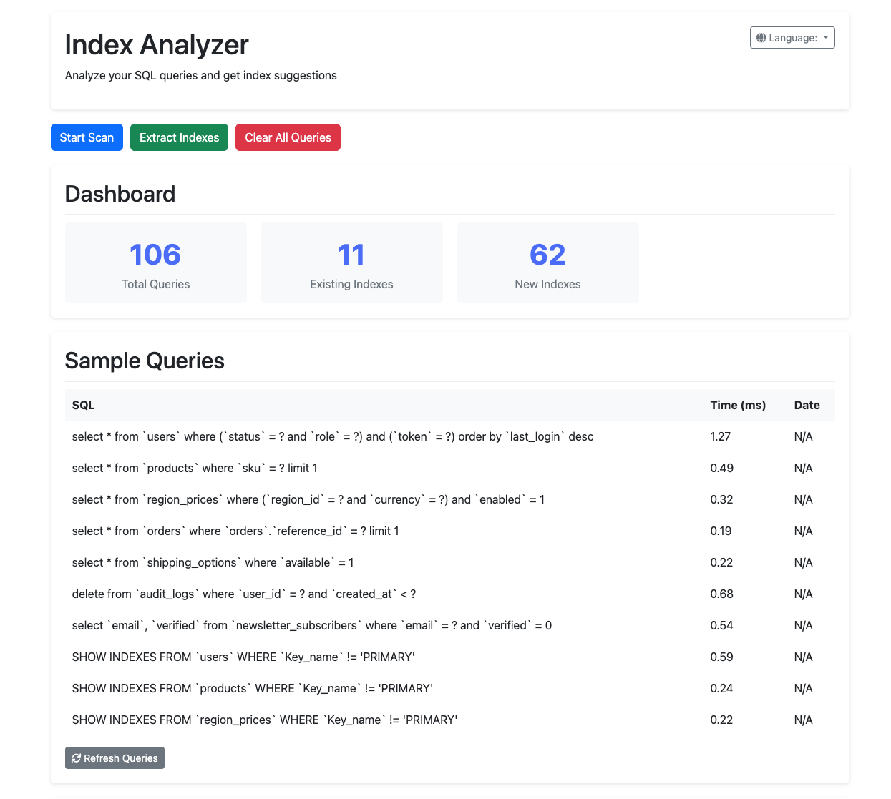
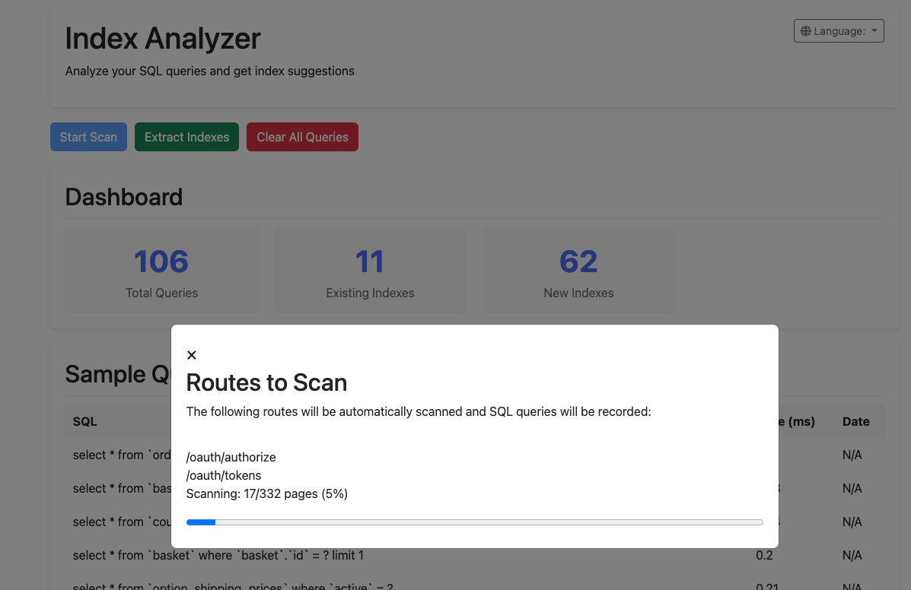
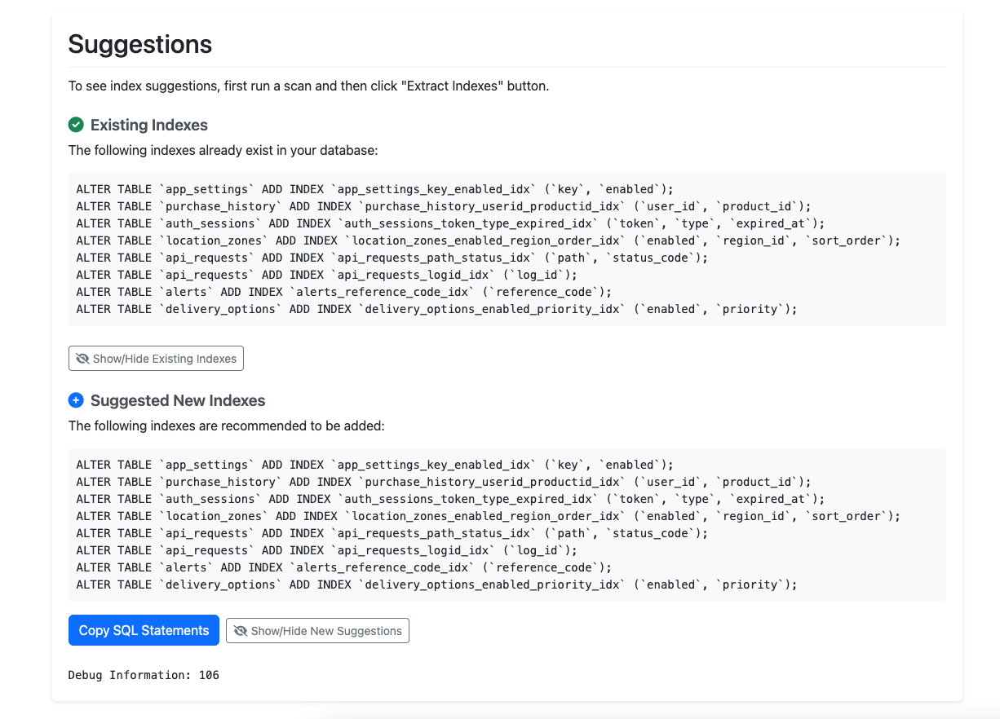

# Laravel Index Analyzer

📊 Automatic SQL Index Suggestion System | Otomatik SQL Index Öneri Sistemi

[](https://packagist.org/packages/sekizlipenguen/laravel-index-analyzer)
[](https://packagist.org/packages/sekizlipenguen/laravel-index-analyzer)
[](https://github.com/sekizlipenguen/laravel-index-analyzer/stargazers)
[](https://packagist.org/packages/sekizlipenguen/laravel-index-analyzer)

[](https://laravel.com/docs/9.x)
[](https://laravel.com/docs/10.x)
[](https://laravel.com/docs/11.x)
[](https://laravel.com/docs/12.x)

[🇬🇧 English](#english) | [🇹🇷 Türkçe](#turkish)

<a name="english"></a>

## 🇬🇧 English

A package that collects all SQL queries used in Laravel-based projects through real user experience (including frontend navigation, AJAX requests), detects missing indexes, and provides SQL suggestions for them. This way, you can improve your database performance and make your application run faster.

### Features

- Simulates real user experience with browser integration
- Easy to use with automatic JS DebugBar
- Analyzes all SQL queries to detect missing indexes
- Intelligently analyzes JOIN, WHERE, ORDER BY, and GROUP BY clauses
- Provides ready-to-use SQL commands for suggested indexes
- Smart caching system that prevents re-analysis of the same queries
- Easy configuration (with .env and config file)
- Minimal system resource usage

### Installation

```bash
composer require sekizlipenguen/laravel-index-analyzer
```

To publish the config file:

```bash
php artisan vendor:publish --provider="SekizliPenguen\IndexAnalyzer\IndexAnalyzerServiceProvider"
```

## Ekran Görüntüleri

### Dashboard



### Tarama Süreci



### İndeks Önerileri



### Usage

1. Add the following setting to your `.env` file:

```
INDEX_ANALYZER_ENABLED=true
```

2. It is recommended to use it in a development environment. When using it in a production environment, it is advised to set this to false.

3. There are two usage options:

   **A. Using DebugBar:**
   - Use the debugbar that appears at the bottom of your browser while visiting your pages
   - Click the "Start Scan" button to start automatic scanning
   - Navigate through as many pages of your application as possible (simulate normal user experience)
   - Access login-required pages, admin panels, and special routes by logging in
   - When all your navigation is complete, click "Extract Indexes" to view analysis results
   - You can directly copy the suggested SQL commands

   **B. Using Control Panel:**
   - Access the control panel by going to `/index-analyzer` (e.g., `https://yoursite.com/index-analyzer`)
   - Click "Start Scan" to start scanning automatic routes
   - Manually navigate through additional pages (especially important for login-required pages)
   - View index suggestions and SQL commands

### How It Works

1. **Query Collection**:
   - All SQL queries in your application are automatically captured
   - Open GET routes can be automatically scanned
   - When you manually navigate through login-required pages, queries on these pages are also recorded
   - All database queries are captured, including those in AJAX requests
   - Repeated queries are intelligently filtered

2. **Data Analysis**:
   - Collected queries are analyzed in detail
   - Columns in WHERE, JOIN, ORDER BY, and GROUP BY clauses are detected
   - Queries with high performance impact are identified
   - Classified according to repetition count and execution times

3. **Index Suggestion**:
   - The most appropriate index suggestions are created for frequently used columns with performance impact
   - Intelligent analysis for composite indexes
   - Inter-table relationships are taken into account
   - Conflicts with existing indexes are checked

4. **SQL Generation**:
   - Ready SQL commands are created for suggested indexes
   - Format that you can directly apply to your database is provided
   - Index naming is done automatically and according to standards

### Configuration

You can customize package behavior with the `config/index-analyzer.php` file:

```php
return [
    // Enable/disable IndexAnalyzer (recommended to set to false in production)
    'enabled' => env('INDEX_ANALYZER_ENABLED', false),

    // Query data storage method (memory or file)
    'storage' => env('INDEX_ANALYZER_STORAGE', 'file'),

    // Log file path
    'log_path' => storage_path('logs/index-analyzer.log'),

    // Maximum log file size (10MB default)
    'max_log_size' => 10 * 1024 * 1024,

    // Route prefix
    'route_prefix' => 'index-analyzer',

    // Ignored tables (no suggestions will be created for these tables)
    'ignored_tables' => [
        'migrations',
        'jobs',
        'failed_jobs',
        'password_resets',
        'sessions',
        'personal_access_tokens',
        // You can add your own tables here
    ],

    // Settings for suggestions
    'suggestions' => [
        'min_query_time' => 0,  // Minimum query time in milliseconds
        'min_query_count' => 1, // Minimum query repeat count
    ],
];
```

### Performance Impact

This package is designed to be used in a development environment. To minimize performance impact:

- Uses smart caching to avoid re-recording the same queries
- Doesn't consume system resources when not needed
- File storage option reduces memory usage
- Not recommended for use in production, if used, set `INDEX_ANALYZER_ENABLED=false` in your `.env` file

### Examples

#### Example Analysis Output

```json
{
   "success": true,
   "suggestions": [
      {
         "table": "users",
         "columns": [
            "email",
            "status"
         ],
         "index_name": "users_email_status_idx"
      },
      {
         "table": "orders",
         "columns": [
            "user_id",
            "created_at"
         ],
         "index_name": "orders_user_id_created_at_idx"
      }
   ],
   "statements": [
      "ALTER TABLE `users` ADD INDEX `users_email_status_idx` (`email`,`status`);",
      "ALTER TABLE `orders` ADD INDEX `orders_user_id_created_at_idx` (`user_id`,`created_at`);"
   ]
}
```

<a name="turkish"></a>

## 🇹🇷 Türkçe

Laravel tabanlı projelerde gerçek kullanıcı deneyimi (ön yüz gezinmeleri, AJAX istekleri dahil) üzerinden kullanılan tüm SQL sorgularını toplayan, eksik indeksleri tespit eden ve bunlar için SQL önerileri sunan bir paket. Bu sayede veritabanı performansınızı iyileştirebilir ve uygulamanızın daha hızlı çalışmasını sağlayabilirsiniz.

### Özellikler

- Tarayıcı entegrasyonu ile gerçek kullanıcı deneyimini simüle eder
- Otomatik JS DebugBar ile kolay kullanım
- Tüm SQL sorgularını analiz ederek eksik indeksleri tespit eder
- JOIN, WHERE, ORDER BY ve GROUP BY cümlelerini akıllıca analiz eder
- Önerilen indeksler için hazır SQL komutları sunar
- Aynı sorguların tekrar analiz edilmesini önleyen akıllı önbellek sistemi
- Kolay yapılandırma (.env ve config dosyası ile)
- Minimum sistem kaynağı kullanımı

## Kurulum

```bash
composer require sekizlipenguen/laravel-index-analyzer
```

Config dosyasını yayınlamak için:

```bash
php artisan vendor:publish --provider="SekizliPenguen\IndexAnalyzer\IndexAnalyzerServiceProvider"
```

## Kullanım

1. `.env` dosyanıza aşağıdaki ayarı ekleyin:

```
INDEX_ANALYZER_ENABLED=true
```

2. Uygulamanızda geliştirme ortamında kullanmanız önerilir. Production ortamında kullanırken bu ayarı false yapmanız tavsiye edilir.

3. İki kullanım seçeneği vardır:

   **A. DebugBar ile kullanım:**
   - Tarayıcıda sayfalarınızı ziyaret ederken ekranın altında görünen debugbar'ı kullanın
   - "Tarama Başlat" butonu ile otomatik taramayı başlatın
   - Uygulamanın olabildiğince çok sayfasında gezinin (normal kullanıcı deneyimini simüle edin)
   - Giriş gerektiren sayfalara, admin panellerine, ve özel rotalara da giriş yaparak erişin
   - Tüm gezintileriniz bittiğinde "İndexleri Çıkar" butonuna tıklayarak analiz sonuçlarını görüntüleyin
   - Önerilen SQL komutlarını doğrudan kopyalayabilirsiniz

   **B. Kontrol Paneli ile kullanım:**
   - `/index-analyzer` adresine giderek kontrol paneline erişin (ör: `https://siteadi.com/index-analyzer`)
   - "Tarama Başlat" butonuna tıklayarak otomatik rotaları taramayı başlatın
   - Elle ek sayfalarda gezinti yapın (özellikle giriş gerektiren sayfalar için önemli)
   - İndeks önerilerini ve SQL komutlarını görüntüleyin

## Nasıl Çalışır?

1. **Sorgu Toplama**:
   - Uygulamanızda gerçekleşen tüm SQL sorguları otomatik olarak yakalanır
   - Açık GET rotaları otomatik olarak taranabilir
   - Giriş gerektiren sayfaları manuel olarak gezdiğinizde bu sayfalardaki sorgular da kaydedilir
   - AJAX isteklerindeki sorgular dahil tüm veritabanı sorguları yakalanır
   - Tekrarlanan sorgular akıllıca filtrelenir

2. **Veri Analizi**:
   - Toplanan sorgular detaylı olarak analiz edilir
   - WHERE, JOIN, ORDER BY ve GROUP BY cümlelerindeki sütunlar tespit edilir
   - Performans etkisi yüksek olan sorgular belirlenir
   - Tekrar sayısı ve çalışma sürelerine göre sınıflandırılır

3. **İndeks Önerisi**:
   - Sık kullanılan ve performans etkisi olan sütunlar için en uygun indeks önerileri oluşturulur
   - Birleşik (composite) indeksler için akıllı analizler yapılır
   - Tablolar arası ilişkiler dikkate alınır
   - Mevcut indekslerle çakışmalar kontrol edilir

4. **SQL Üretimi**:
   - Önerilen indeksler için hazır SQL komutları oluşturulur
   - Doğrudan veritabanınıza uygulayabileceğiniz format sunulur
   - İndeks isimlendirmesi otomatik ve standartlara uygun şekilde yapılır

## Yapılandırma

`config/index-analyzer.php` dosyası ile paket davranışını özelleştirebilirsiniz:

```php
return [
    // IndexAnalyzer'ı aktif/pasif yapma (üretim ortamında false yapmanız önerilir)
    'enabled' => env('INDEX_ANALYZER_ENABLED', false),

    // Sorgu verilerinin depolanma yöntemi (memory veya file)
    'storage' => env('INDEX_ANALYZER_STORAGE', 'file'),

    // Log dosyası yolu
    'log_path' => storage_path('logs/index-analyzer.log'),

    // Maksimum log dosyası boyutu (10MB varsayılan)
    'max_log_size' => 10 * 1024 * 1024,

    // Rota öneki
    'route_prefix' => 'index-analyzer',

    // Yoksayılan tablolar (bu tablolar için öneri oluşturulmaz)
    'ignored_tables' => [
        'migrations',
        'jobs',
        'failed_jobs',
        'password_resets',
        'sessions',
        'personal_access_tokens',
        // Kendi tablolarınızı buraya ekleyebilirsiniz
    ],

    // Öneriler için ayarlar
    'suggestions' => [
        'min_query_time' => 0,  // Milisaniye cinsinden minimum sorgu süresi
        'min_query_count' => 1, // Minimum sorgu tekrar sayısı
    ],
];
```

## Performans Etkisi

Bu paket, geliştirme ortamında kullanılmak üzere tasarlanmıştır. Performans etkisini minimize etmek için:

- Aynı sorguları tekrar kaydetmemek için akıllı önbellek kullanır
- İhtiyaç duyulmadığında sistem kaynağı tüketmez
- Dosya depolaması seçeneği, bellek kullanımını azaltır
- Production ortamında kullanım önerilmez, kullanılacaksa `.env` dosyasında `INDEX_ANALYZER_ENABLED=false` ayarı yapılmalıdır

## Örnekler

### Örnek Analiz Çıktısı

```json
{
   "success": true,
   "suggestions": [
      {
         "table": "users",
         "columns": [
            "email",
            "status"
         ],
         "index_name": "users_email_status_idx"
      },
      {
         "table": "orders",
         "columns": [
            "user_id",
            "created_at"
         ],
         "index_name": "orders_user_id_created_at_idx"
      }
   ],
   "statements": [
      "ALTER TABLE `users` ADD INDEX `users_email_status_idx` (`email`,`status`);",
      "ALTER TABLE `orders` ADD INDEX `orders_user_id_created_at_idx` (`user_id`,`created_at`);"
   ]
}
```

## Pratik Kullanım İpuçları

**En Etkili Kullanım İçin**

1. **Kapsamlı Gezinti Yapın**:
   - Uygulamanızın mümkün olduğunca çok sayfasında gezinin
   - Admin paneli, üye sayfaları gibi giriş gerektiren alanlara mutlaka giriş yapın
   - Filtrelemeleri, aramaları ve AJAX ile yüklenen içerikleri test edin
   - Raporlama, listeleme gibi ağır sorgu içeren sayfaları ziyaret edin

2. **Gerçek Kullanıcı Senaryoları**:
   - Gerçek kullanıcıların yapacağı işlemleri simüle edin
   - Sipariş verme, kayıt olma, ürün arama gibi tipik işlemleri gerçekleştirin
   - Her türlü filtre ve sıralama seçeneğini deneyin

3. **Otomatik Tarayıcıyı Doğru Kullanın**:
   - Otomatik tarayıcı sadece açık (giriş gerektirmeyen) rotaları tarar
   - Giriş gerektiren sayfalar için manuel olarak giriş yapıp gezinmeniz gerekir
   - Her işlemden sonra indeks önerilerini kontrol edin

## Sorun Giderme

**Tarayıcı taraması çalışmıyor**

- JavaScript konsolunda hata olup olmadığını kontrol edin
- Tarayıcınızın aynı kaynaktan JavaScript yüklemesine izin verdiğinden emin olun
- CORS politikalarının taramaya engel olmadığından emin olun

**Hiç sorgu kaydedilmiyor**

- `.env` dosyasında `INDEX_ANALYZER_ENABLED=true` ayarını kontrol edin
- Sorgu log klasörünün yazılabilir olduğundan emin olun
- Uygulama yetkilerini kontrol edin
- Laravel Debug Bar'ın yüklendiğinden emin olun

**Bazı sorgular analizde görünmüyor**

- `ignored_tables` ayarında ilgili tabloların olmadığından emin olun
- Çok hızlı çalışan sorgular için `min_query_time` değerini 0 olarak ayarlayın
- Bazı ORM sorguları gerçekte çalıştırılmamış olabilir (lazy loading)

## Katkıda Bulunma

Katkılarınızı bekliyoruz! Lütfen PR göndermeden önce şunları yapın:

1. Testlerinizi yazın
2. Kodunuzu PSR-12 standartlarına göre biçimlendirin
3. Açıklayıcı commit mesajları kullanın

## Lisans

MIT lisansı altında lisanslanmıştır. Detaylar için [LICENSE](LICENSE) dosyasına bakınız.
